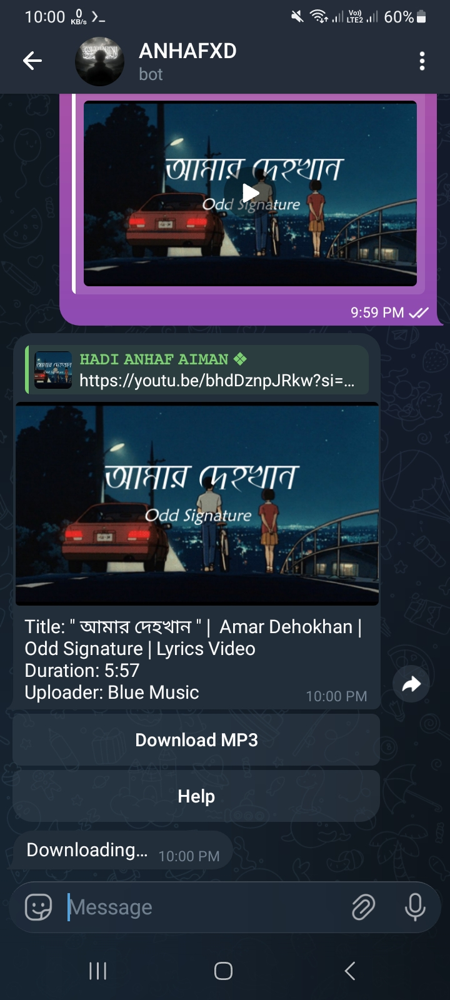

<!--
  README for: Telegram YouTube MP3 Downloader Bot
  GitHub: @algoanhaf
-->

<div align="center">

<h1>Telegram YouTube MP3 Downloader Bot</h1>

<p>
  A clean, fast, <b>production-ready</b> Telegram bot that converts YouTube videos into <b>MP3</b>.
</p>

<p>
  <a href="https://www.python.org/"></a>
  <a href="https://core.telegram.org/bots/api"></a>
  <a href="https://github.com/algoanhaf"></a>
  
  
</p>


</div>

---

## ✨ What it does

This bot works in **private chats** and **groups**, supports **command-based usage** + **inline buttons**, and shows a clean **preview card** (thumbnail, title, duration) before downloading.

✅ Built for **Termux (Android)** + **Python 3.12+**  
✅ Lightweight dependencies  
✅ No aiogram • No Rust dependency

---

## ✅ Features

- Convert YouTube videos to **MP3**
- **Group command** support with reply-style response
- **Private chat** button-based download flow
- Preview card before download:
  - Thumbnail image
  - Video title
  - Duration
- Inline **Download MP3** button
- Clean temporary file handling
- Fast + stable performance
- Termux friendly

---

## 🚀 Usage

### Group Chat Usage

Send this command in a group:

```bash
/download_mp3 https://youtu.be/VIDEO_ID
```

The bot replies directly to the command message with:
- Thumbnail
- Title
- Duration
- Download MP3 button

### Private Chat Usage

1. Start the bot
2. Press **Download MP3**
3. Send a YouTube video link
4. Press **Download MP3** from the preview

---

## 🖼️ Preview Images

<div align="center">

<h3>Private Chat Preview</h3>



</div>


## 📦 Requirements

- **Python 3.12+**
- **ffmpeg**
- Telegram **Bot Token**

---

## 📱 Termux Installation (Android)

```bash
pkg update -y && pkg upgrade -y
pkg install -y python ffmpeg git
```

---

## 🧰 Python Package Installation

```bash
pip install -U pip
pip install pytelegrambotapi yt-dlp aiofiles
```

---

## 🧱 Project Setup

Clone the repository:

```bash
git clone https://github.com/algoanhaf/MP3.git
cd MP3
```

---

## ▶️ Run the Bot

```bash
python bot_mp3.py
```

### Run in background (optional)

```bash
nohup python bot_mp3.py > bot.log 2>&1 &
```

---

## 🧠 Notes (so your bot doesn’t act goofy)

- If downloads fail, confirm `ffmpeg` is installed and accessible in PATH.
- For Termux, allow storage if you need local file access:
  ```bash
  termux-setup-storage
  ```
- Keep temp files in a dedicated folder and clean up after sending.

<div align="center">


<b>Made by @algoanhaf</b>

</div>
